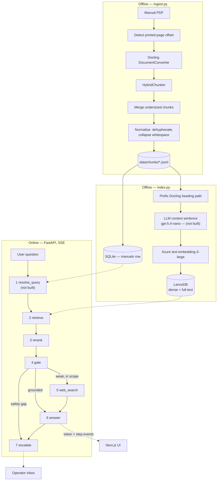

# Architecture

This document describes the intended boundaries and data flow. It must be kept in step with the code.
If a component named here does not exist yet, it is marked **(not built)**.

Everything runs locally. Azure OpenAI and Tavily are the only network calls.

Status: the offline half is built — parse, normalise, merge, page-offset detection, embedding and
indexing. Of the online half, `retrieve`, `rerank`, `gate`, `web_search` and `answer` are built, along
with the SSE transport, the SQLite session store and `escalate`. The chat and PDF screens are built
and drive those end to end from a browser. `resolve_query` and the operator inbox are not. Each is
marked **(not built)** below.

## Two halves

Ingestion is offline and runs once per manual. The application is online and never parses a PDF.



## Pipeline steps

Each step is a class in `backend/app/pipeline/` with one `run(ctx)` method. `build_pipeline()`
assembles them in order. Adding a capability means adding a step. Steps 2 through 7 are built;
`build_pipeline()` returns those six.

**1 · resolve_query — (not built)** — If the turn is a follow-up, rewrite it into a standalone question using the
last ~6 user turns, then concatenate the rewrite with the raw question. If there is no history, pass
through untouched. Also classifies whether the user is reporting that a previous suggestion failed,
which drives `unresolved_streak` (D14). This is what makes a reopened conversation continue correctly.

**2 · retrieve** — Hybrid search in LanceDB scoped to the session's manual: BM25 full-text and dense
vector in parallel, fused with Reciprocal Rank Fusion at k=60. Returns 12 candidates carrying page
numbers and headings.

**3 · rerank** — Local cross-encoder (ONNX, CPU) scores those 12 candidates and returns the best 6.
One stage of 12, not D3's 100 → 30: Recall@10 over the fused candidates is 100%, so reranking a
longer tail costs latency and buys nothing measurable. Measured at ~1,249 ms on this laptop, not the
~300 ms D3 assumed — the largest single cost before the first token. See build-log Slice 5.

**4 · gate** — Reads **cross-encoder** scores from step 3, never the RRF fusion scores from step 2.
Fusion scores rank position rather than relevance, and measurably cannot separate a grounded question
from a request for a poem (D3). The assistant does not dead-end: a weak manual result downgrades the
*source* of the answer, it does not refuse the question.

Above `GATE_HIGH` the manual answers and **no grader runs** — no call, and no step event. At or below
it the grader runs once and reports three observations; `decide()` turns those into a route:

| Grader says | Score | Route | Answer source |
|---|---|---|---|
| — (not called) | above HIGH | answer from manual | `manual` |
| not about the domain | any | decline | — |
| passages answer it | above LOW | answer from manual | `manual` |
| passages answer it | at or below LOW | answer from manual, supplement the gaps | `manual+general` |
| passages do not, safety topic | any | escalate — never improvise here | — |
| passages do not | any | web search + general expertise | `general` |

`GATE_LOW` does **not** decide whether the grader is called — only `GATE_HIGH` does. `GATE_LOW`
separates a confident manual answer from one that needs supplementing, once the grader has said the
passages answer the question.

This is the Corrective-RAG pattern. The routing rules are a pure function over a score and three
booleans; the grader is the only model call, and it reports observations, not a destination.

**5 · web_search** — Conditional, and only on the `general` route: `manual+general` keeps to the
manual plus general guidance, so only a total miss earns a network call (brief items 15 and 16). The
query is the manual's stored title plus the question. Domain restriction, when configured, is passed
to Tavily as the `include_domains` **parameter** — never written into the query as a `site:` operator,
which Tavily treats as ordinary words. `search_depth` is `basic`: measured here, `advanced` doubled
the content but also the latency, for two credits instead of one.

A failure — missing key, dead network, zero results — leaves `ctx.web` empty and the answer falls
through to general knowledge. D14 wants *manual weak and web weak* to escalate; that trigger is
**(not built)**, so this degrades rather than dead-ends.

**6 · answer** — One structured, streamed call returning:

```
format     direct | steps | troubleshoot | explanation
source     manual | manual+general | general
answer     the content, with safety warnings reproduced verbatim
citations  [{ type: "page", page_pdf, page_printed, section }]
           [{ type: "web",  url, title }]
resolved   true | false
```

`source` is assigned in Python from the gate's route and is never accepted from the model, and the
model cites by passage index which Python maps back to real pages — a hallucinated page number is not
expressible. When `source` is `general` the disclaimer sentence is prepended in Python too, because
asked for in the prompt it was supplied on one run and dropped on the next.

`source` drives the UI. A `page` citation is emitted only for content the manual supplied; a `web`
citation only for content web search supplied. The PDF pane responds to `page` citations and ignores
`web` ones. The two pill types must render visibly differently — an unmarked general-knowledge answer
about a real vehicle is the most damaging failure this system can produce, and identical-looking
pills are how that happens (D13).

**7 · escalate** — Deterministic; the gate decides, this step records. Writes an `escalations` row
and streams the user a confirmation carrying its reference. It sets `ctx.escalation` rather than
`ctx.answer`: a handoff is not an answer, and `Source` stays `manual | manual+general | general` so
the D13 distinction the UI renders keeps its meaning. The API emits an `escalated` event for it.

Only D14's gate-rule trigger is reachable. **Asking for a person, the unresolved streak, and
manual-weak-and-web-weak are (not built)** — all three need `resolve_query`.

## Transport

`POST /chat` returns Server-Sent Events. FastAPI `StreamingResponse`; no broker, no WebSocket server.

| Route | Purpose |
|---|---|
| `GET /manuals` | picker |
| `GET /manuals/{id}/pdf` | the file the viewer pane renders |
| `POST /sessions` | `{manual}` → a new session |
| `GET /sessions` | history panel |
| `GET /sessions/{id}` | one conversation with its messages and citations |
| `POST /chat` | `{session_id, question}` → the stream below |
| `GET /escalations` | operator inbox; optional `?status=open` |
| `GET /escalations/{id}` | the full handoff package, transcript included |
| `PATCH /escalations/{id}` | `{status}` → open, picked_up or closed |

```
event: step    {"step": "retrieve", "label": "Searching the manual"}
event: step    {"step": "retrieve", "label": "Found 6 passages in Maintenance > Tyres"}
event: step    {"step": "web",      "label": "Not in the manual — checking the web"}
event: token   {"text": "..."}
event: done    {"source": "manual", "citations": [...], "resolved": true}
```

A handed-over question ends with `event: escalated {"id": "ESC-B40531", ...}` instead of `done`. It
carries no `source` and no citations, because it is a handoff rather than an answer.

Plus `event: error`, because a stream that dies silently is indistinguishable from one still thinking.

Step events describe work that actually happened. No invented stages, no artificial delays. A step
that is skipped emits no event — above `GATE_HIGH` no grader runs, so no `gate` event is sent.

The pipeline is synchronous by design. `POST /chat` runs it on a worker thread whose sink pushes to a
`queue.Queue`, and the response generator drains that queue; that, not async, is what lets a step
event reach the browser while the next step is still running. The eval harness and playground scripts
pass no sink and are unaffected.

The cross-encoder is loaded during FastAPI's `lifespan` startup. Left lazy it cost the first question
~6.5 s — measured 8.66 s to first token cold against 2.89 s warm — which in a demo lands on the first
question anyone asks.

## Boundaries

- Azure, LanceDB, Docling and Tavily SDK types stop in `backend/app/providers/`.
- Gate routing and escalation triggers are pure functions over scores and counters. The gate's
  ambiguous-band grader is the single exception, and it returns a relevance score, not a route.
- `api.py` owns HTTP and SSE framing, `db.py` owns SQLite, and the pipeline owns orchestration.
  There is no separate service layer: `build_pipeline()` already is one, and a module that only
  forwards calls to it would be a layer with nothing in it.
- Settings are read only through `backend/app/config.py` and `frontend/src/lib/config.ts`.

## Data model

`data/app.db`, stdlib `sqlite3`, no ORM. All four tables are built. `escalations` does not copy the
transcript — that is the session's `messages`, joined when the package is read. `messages` carries a
nullable `escalation_id` so a reopened conversation still shows the handoff as a handoff.

```
manuals      id, title, filename, page_count, page_offset, ingested_at

sessions     id, manual_id, title, created_at, updated_at

messages     id, session_id, role, content, source, format,
             citations_json, created_at, escalation_id

escalations  id, session_id, manual_id, question, reason, pages_json,
             status, created_at, updated_at
```

`manual_id` sits on the session, not the message — a conversation is locked to one manual (D11).

`sessions` carries no `unresolved_streak` column yet; it arrives with `escalate` (D14).

**The database is derived state and may be deleted.** The `manuals` row is written by `index.py`,
which also embeds — so recovering a deleted `app.db` would otherwise cost a paid embedding run.
`index.py --register-only` rewrites the row from the JSONL and the PDF in seconds instead.

`page_offset` is detected per manual at ingest. In the BJ30 manual the printed page number is 5 lower
than the PDF index — the answer cites the printed number, the viewer navigates by the PDF index.
Getting this backwards shows the wrong page to the user.

## Screens

Next.js 16 with React 19 and Tailwind 4, in `frontend/`. One route, a resizable two-pane split.

| Screen | Purpose | State |
|---|---|---|
| Chat | Manual picker, conversation, streamed answer, citation pills, session history panel | built |
| PDF pane | Renders the cited page beside the answer; citations navigate it | built |
| Operator inbox | Lists open escalations; opens the full handoff package for one (D12) | **(not built)** |

The same shape as the backend: one boundary for the wire, settings read once, components
presentational.

| Module | Holds |
|---|---|
| `lib/config.ts` | The API base URL and `PAGE_WINDOW`. The only place environment values are read. |
| `types/chat.ts` | The backend contract — `Citation` discriminated on `type`, `Source`, the four `StreamEvent`s. A backend change fails the type check here. |
| `lib/api.ts` | Every `fetch`, plus SSE frame parsing. `streamChat` is an async generator of typed events; nothing else knows the wire format. |
| `hooks/use-chat-stream.ts` | Appends tokens, collects step labels, finalises on `done`. The only stateful piece. |
| `components/` | `chat/`, `pdf/`, `source/`, `layout/`. Props in, callbacks out. |

**The PDF pane mounts a window, not the document.** `PAGE_WINDOW` pages around the current one are
rendered; the rest are sized spacers, so the scrollbar stays proportional and any page is reachable by
scrolling. PDF.js degrades past roughly 25 pages mounted at once and the source project mounted every
page from 1 to the one you jumped to — page 249 meant 249 canvases.

Spacer height is `width × ratio`, where `ratio` is measured from the real page via
`getViewport({scale: 1})` rather than assumed A4. An assumed ratio drifts a few pixels per page, and
by page 17 the error exceeded a page height and pages appeared to vanish while scrolling.

The worker is served from `public/`, copied at install time by `scripts/copy-pdf-worker.mjs` and
resolved through `react-pdf` — never the hoisted `pdfjs-dist`, whose version can differ. `cmaps/` and
`standard_fonts/` are vendored for the same local-first reason; the CJK cmaps are load-bearing for
these manuals.

Citation pills are visibly different by type, which is the D13 guard rather than styling: page pills
are solid and drive the pane, web pills are dashed and open a tab. Repeated pages merge to one pill.
`resolved` is not rendered — it is unstable run to run.

## Evaluation

`eval/questions.jsonl` — 44 labelled questions, one row each:

```json
{"id": "bj30-01", "question": "...", "manual": "...", "expected_pages": [89, 90],
 "expected_route": "manual", "kind": "procedure"}
```

`expected_route` uses the `Route` vocabulary from `pipeline/base.py`. The 44 rows cover three of the
five: `manual` 38, `general` 4, `decline` 2. **`manual+general` and `escalate` have no labelled rows,
so those two paths are unmeasured** — worth closing once `web_search` and `escalate` exist. `kind` is
`procedure` 22, `spec` 6, `symptom` 5, `safety` 5, `absent` 4, `offtopic` 2, so weakness can be
located rather than just observed. Pages are labelled from the source text, never from retrieval
output.

`eval/run.py` reports Recall@1/3/5/10 and MRR, split by manual and by kind, scoring fusion order
against reranked order over the same candidates. It also prints each question's top reranker score
against `GATE_HIGH` / `GATE_LOW`, which is how the bands were calibrated. End-to-end routing accuracy
is **(not built)**: the harness stops at the score and never calls the grader or the answer step.
Answer prose is never scored.

## Deliberate omissions

Recorded so they are not mistaken for oversights. Reasons in `docs/decisions.md`.

- No agent framework. The flow is linear with two conditional branches.
- No semantic chunking, no Self-RAG, no reflection loops.
- No vision or multimodal retrieval — no GPU available.
- No WebSocket. Streaming is SSE, one-directional (D9).
- No external helpdesk integration. Escalations stay local (D12).
