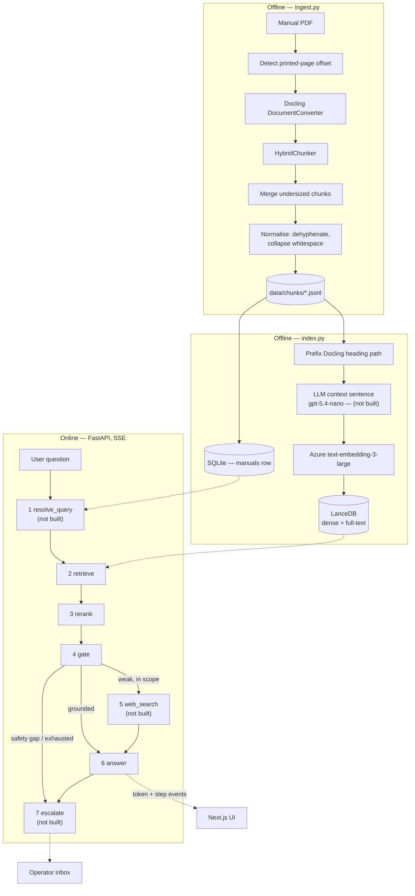

# Architecture

This document describes the intended boundaries and data flow. It must be kept in step with the code.
If a component named here does not exist yet, it is marked **(not built)**.

Everything runs locally. Azure OpenAI and Tavily are the only network calls.

Status: the offline half is built — parse, normalise, merge, page-offset detection, embedding and
indexing. Of the online half, `retrieve`, `rerank`, `gate` and `answer` are built, along with the SSE
transport and the SQLite session store; `playground/check_api.py` drives them end to end.
`resolve_query`, `web_search`, `escalate`, the `escalations` table and the UI are not built. Each is
marked **(not built)** below.

## Two halves

Ingestion is offline and runs once per manual. The application is online and never parses a PDF.



## Pipeline steps

Each step is a class in `backend/app/pipeline/` with one `run(ctx)` method. `build_pipeline()`
assembles them in order. Adding a capability means adding a step. Steps 2, 3, 4 and 6 are built;
`build_pipeline()` currently returns those four.

**1 · resolve_query — (not built)** — If the turn is a follow-up, rewrite it into a standalone question using the
last ~6 user turns, then concatenate the rewrite with the raw question. If there is no history, pass
through untouched. Also classifies whether the user is reporting that a previous suggestion failed,
which drives `unresolved_streak` (D14). This is what makes a reopened conversation continue correctly.

**2 · retrieve** — Hybrid search in LanceDB scoped to the session's manual: BM25 full-text and dense
vector in parallel, fused with Reciprocal Rank Fusion at k=60. Returns 12 candidates carrying page
numbers and headings.

**3 · rerank** — Local cross-encoder (ONNX, CPU) scores those 12 candidates and returns the best 6.
One stage of 12, not D3's 100 → 30: Recall@10 over the fused candidates is 100%, so reranking a
longer tail costs latency and buys nothing measurable. Measured at ~1,249 ms on this laptop, not the
~300 ms D3 assumed — the largest single cost before the first token. See build-log Slice 5.

**4 · gate** — Reads **cross-encoder** scores from step 3, never the RRF fusion scores from step 2.
Fusion scores rank position rather than relevance, and measurably cannot separate a grounded question
from a request for a poem (D3). The assistant does not dead-end: a weak manual result downgrades the
*source* of the answer, it does not refuse the question.

| Condition | Route | Answer source |
|---|---|---|
| top score above HIGH | answer from manual | `manual` |
| top score in partial band | answer from manual, supplement the gaps | `manual+general` |
| below LOW, safety-critical topic | escalate — never improvise here | — |
| below LOW, still about the product | web search + general expertise | `general` |
| below LOW, not about the product | decline | — |
| ambiguous band | one LLM grader call, then as above | — |

This is the Corrective-RAG pattern. The routing rules are pure functions over scores; the only model
call is the grader in the ambiguous band, and it returns a score, not a destination.

**5 · web_search — (not built)** — Conditional. Runs only when the gate routes here. Tavily, scoped by
the `DOMAIN_DESCRIPTION` config value. Results carry no page citations.

**6 · answer** — One structured, streamed call returning:

```
format     direct | steps | troubleshoot | explanation
source     manual | manual+general | general
answer     the content, with safety warnings reproduced verbatim
citations  [{ type: "page", page_pdf, page_printed, section }]
           [{ type: "web",  url, title }]
resolved   true | false
```

`source` is assigned in Python from the gate's route and is never accepted from the model, and the
model cites by passage index which Python maps back to real pages — a hallucinated page number is not
expressible. When `source` is `general` the disclaimer sentence is prepended in Python too, because
asked for in the prompt it was supplied on one run and dropped on the next.

`source` drives the UI. A `page` citation is emitted only for content the manual supplied; a `web`
citation only for content web search supplied. The PDF pane responds to `page` citations and ignores
`web` ones. The two pill types must render visibly differently — an unmarked general-knowledge answer
about a real vehicle is the most damaging failure this system can produce, and identical-looking
pills are how that happens (D13).

**7 · escalate — (not built)** — Deterministic. Triggers and streak mechanics in D14. Writes an
`escalations` row and surfaces a reference number to the user. The gate already emits the `escalate`
route; `AnswerStep` currently returns no answer for it.

## Transport

`POST /chat` returns Server-Sent Events. FastAPI `StreamingResponse`; no broker, no WebSocket server.

| Route | Purpose |
|---|---|
| `GET /manuals` | picker |
| `GET /manuals/{id}/pdf` | the file the viewer pane renders |
| `POST /sessions` | `{manual}` → a new session |
| `GET /sessions` | history panel |
| `GET /sessions/{id}` | one conversation with its messages and citations |
| `POST /chat` | `{session_id, question}` → the stream below |

```
event: step    {"step": "retrieve", "label": "Searching the manual"}
event: step    {"step": "retrieve", "label": "Found 6 passages in Maintenance > Tyres"}
event: step    {"step": "web",      "label": "Not in the manual — checking the web"}
event: token   {"text": "..."}
event: done    {"source": "manual", "citations": [...], "resolved": true}
```

Plus `event: error`, because a stream that dies silently is indistinguishable from one still thinking.

Step events describe work that actually happened. No invented stages, no artificial delays. A step
that is skipped emits no event — above `GATE_HIGH` no grader runs, so no `gate` event is sent.

The pipeline is synchronous by design. `POST /chat` runs it on a worker thread whose sink pushes to a
`queue.Queue`, and the response generator drains that queue; that, not async, is what lets a step
event reach the browser while the next step is still running. The eval harness and playground scripts
pass no sink and are unaffected.

The cross-encoder is loaded during FastAPI's `lifespan` startup. Left lazy it cost the first question
~6.5 s — measured 8.66 s to first token cold against 2.89 s warm — which in a demo lands on the first
question anyone asks.

## Boundaries

- Azure, LanceDB, Docling and Tavily SDK types stop in `backend/app/providers/`.
- Gate routing and escalation triggers are pure functions over scores and counters. The gate's
  ambiguous-band grader is the single exception, and it returns a relevance score, not a route.
- `api.py` owns HTTP and SSE framing, `db.py` owns SQLite, and the pipeline owns orchestration.
  There is no separate service layer: `build_pipeline()` already is one, and a module that only
  forwards calls to it would be a layer with nothing in it.
- Settings are read only through `backend/app/config.py` and `frontend/src/lib/config.ts`.

## Data model

`data/app.db`, stdlib `sqlite3`, no ORM. `manuals`, `sessions` and `messages` are built;
`escalations` is **(not built)**.

```
manuals      id, title, filename, page_count, page_offset, ingested_at

sessions     id, manual_id, title, created_at, updated_at

messages     id, session_id, role, content, source, format,
             citations_json, created_at

escalations  id, session_id, reference, issue_summary, steps_tried_json,
             pages_shown_json, trigger_reason, suggested_next,
             transcript_json, created_at
```

`manual_id` sits on the session, not the message — a conversation is locked to one manual (D11).

`sessions` carries no `unresolved_streak` column yet; it arrives with `escalate` (D14).

**The database is derived state and may be deleted.** The `manuals` row is written by `index.py`,
which also embeds — so recovering a deleted `app.db` would otherwise cost a paid embedding run.
`index.py --register-only` rewrites the row from the JSONL and the PDF in seconds instead.

`page_offset` is detected per manual at ingest. In the BJ30 manual the printed page number is 5 lower
than the PDF index — the answer cites the printed number, the viewer navigates by the PDF index.
Getting this backwards shows the wrong page to the user.

## Screens — (not built)

| Screen | Purpose |
|---|---|
| Chat | Manual picker, conversation, streamed answer, citation pills, session history panel |
| PDF pane | Renders the cited page beside the answer; citations navigate it |
| Operator inbox | Lists open escalations; opens the full handoff package for one (D12) |

## Evaluation

`eval/questions.jsonl` — 44 labelled questions, one row each:

```json
{"id": "bj30-01", "question": "...", "manual": "...", "expected_pages": [89, 90],
 "expected_route": "manual", "kind": "procedure"}
```

`expected_route` uses the `Route` vocabulary from `pipeline/base.py`. The 44 rows cover three of the
five: `manual` 38, `general` 4, `decline` 2. **`manual+general` and `escalate` have no labelled rows,
so those two paths are unmeasured** — worth closing once `web_search` and `escalate` exist. `kind` is
`procedure` 22, `spec` 6, `symptom` 5, `safety` 5, `absent` 4, `offtopic` 2, so weakness can be
located rather than just observed. Pages are labelled from the source text, never from retrieval
output.

`eval/run.py` reports Recall@1/3/5/10 and MRR, split by manual and by kind, scoring fusion order
against reranked order over the same candidates. It also prints each question's top reranker score
against `GATE_HIGH` / `GATE_LOW`, which is how the bands were calibrated. End-to-end routing accuracy
is **(not built)**: the harness stops at the score and never calls the grader or the answer step.
Answer prose is never scored.

## Deliberate omissions

Recorded so they are not mistaken for oversights. Reasons in `docs/decisions.md`.

- No agent framework. The flow is linear with two conditional branches.
- No semantic chunking, no Self-RAG, no reflection loops.
- No vision or multimodal retrieval — no GPU available.
- No WebSocket. Streaming is SSE, one-directional (D9).
- No external helpdesk integration. Escalations stay local (D12).
