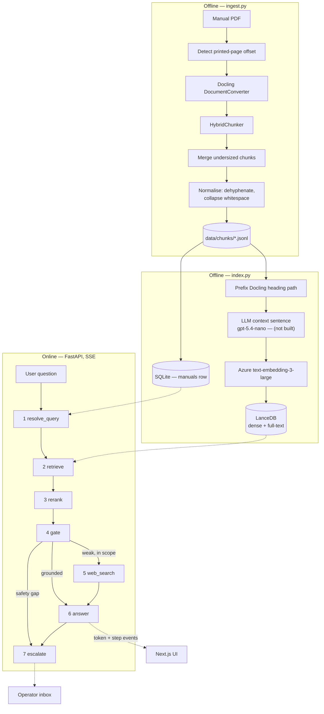
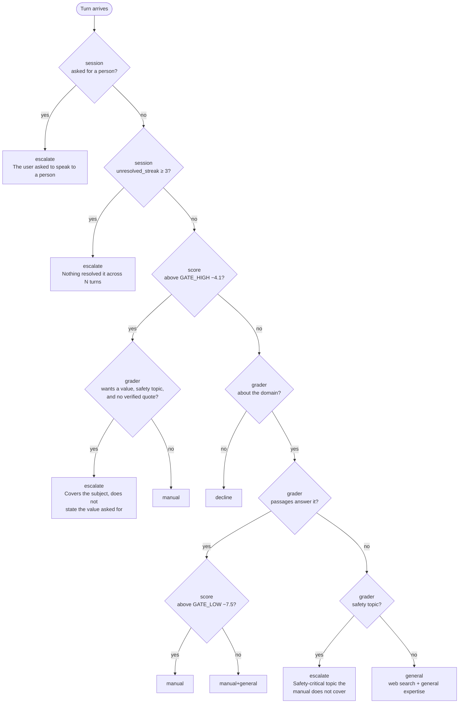
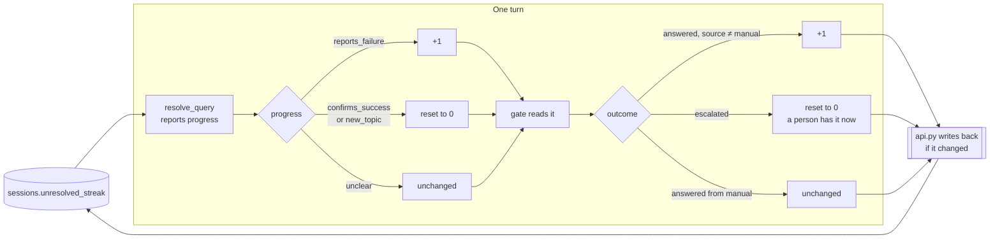

# Architecture

This document describes the intended boundaries and data flow. It must be kept in step with the code.
If a component named here does not exist yet, it is marked **(not built)**.

Everything runs locally. Azure OpenAI and Tavily are the only network calls.

Status: the offline half is built — parse, normalise, merge, page-offset detection, embedding and
indexing. The online half is built end to end — `resolve_query`, `retrieve`, `rerank`, `gate`,
`web_search`, `answer` and `escalate` — along with the SSE transport and the SQLite session store.
The chat, PDF and operator screens drive those from a browser. D14's fourth escalation trigger and
D4's context sentence are not built. Each is marked **(not built)** below.

## Two halves

Ingestion is offline and runs once per manual. The application is online and never parses a PDF.



## Pipeline steps

Each step is a class in `backend/app/pipeline/` with one `run(ctx)` method. `build_pipeline()`
assembles them in order. Adding a capability means adding a step. All seven are built;
`build_pipeline()` returns them in this order.

**1 · resolve_query** — If the turn is a follow-up, rewrite it into a standalone question using the
last ~6 user turns, then concatenate the rewrite with the raw question so the user's own wording still
feeds BM25. If there is no history, pass through untouched — no model call and no step event. The
rewrite must name the task it concerns; "what should I do next" without naming what is being done
retrieves nothing, which is how it first failed (D20). Everything downstream reads `ctx.query`, so
retrieval, the grader and the answer all see the resolved question.

The same call reports two things for D14 without costing another: whether the user asked for a
person, and whether the turn reports a failure, confirms success or changes subject. It observes;
`next_streak()` counts and `decide()` routes.

**2 · retrieve** — Hybrid search in LanceDB scoped to the session's manual: BM25 full-text and dense
vector in parallel, fused with Reciprocal Rank Fusion at k=60. Returns 12 candidates carrying page
numbers and headings.

**3 · rerank** — Local cross-encoder (ONNX, CPU) scores those 12 candidates and returns the best 6.
One stage of 12, not D3's 100 → 30: Recall@10 over the fused candidates is 100%, so reranking a
longer tail costs latency and buys nothing measurable. Measured at ~1,249 ms on this laptop, not the
~300 ms D3 assumed — the largest single cost before the first token. See build-log Slice 5.

A passage longer than the model's 512-token window is scored window by window and keeps its best
(Slice 10). `rank()` returns that winning window alongside the score, and `RerankStep` carries it on
each passage as `excerpt` — the span the score was actually measured on. The gate reads `excerpt`;
the answer step reads the full `text`.

**4 · gate** — Reads **cross-encoder** scores from step 3, never the RRF fusion scores from step 2.
Fusion scores rank position rather than relevance, and measurably cannot separate a grounded question
from a request for a poem (D3). The assistant does not dead-end: a weak manual result downgrades the
*source* of the answer, it does not refuse the question.

**The grader runs on every question** (D22). Above `GATE_HIGH` the score still decides, with one
exception, because a high score means the manual *discusses* the subject and not that it *states the
number asked for*. `decide()` turns the observations into a route; the branching is drawn below.

Each route fixes what the user is shown, and `source` is assigned in Python from it, never by a model:

| Route | Answer source | Citations |
|---|---|---|
| `manual` | `manual` | pages |
| `manual+general` | `manual+general` | pages, with the gaps marked in prose |
| `general` | `general` | web results, behind a "not covered by your manual" line |
| `decline` | `general` | none — one short refusal |
| `escalate` | — | a handoff record; no answer is written at all |

The override is deliberately narrow. It fires only where the answer is a **specific value**, so it can
be checked: `quoted()` verifies the grader's `answer_quote` really appears in the excerpts it was
shown, ignoring whitespace and case. A procedure has no single sentence carrying its answer, so an
absent quote proves nothing about one and the rule never applies. Vetoing on the grader's booleans
alone was measured and is worse than leaving the bypass in place — the numbers are in D22.

### Which rule decides, and what it was told

`decide()` in evaluation order. **session** inputs come from the SQLite session row and the turn's
own history; **grader** inputs are observations from one model call; **score** is the cross-encoder's.
Nothing a model returns is used as a destination, and the grader is never shown the score or the bands.



The second line of each `escalate` box is the `escalation_trigger` written into the handoff record, so
an operator reads why a question reached them rather than one constant for all of them (D12, D14, D22).

### What survives between turns

One integer on the session, `unresolved_streak`, plus the transcript. `api.py` reads both before the
turn runs and writes the counter back only if a step changed it — persistence stays at the boundary,
so the pipeline can be exercised by the eval harness with no database (D20, D21).



A first turn has no history, so `resolve_query` makes no call and the left branch does not run; the
counter can still move on the right, from an answer that was not grounded in the manual.

Neither band decides whether the grader is called — since D22 it always is. `GATE_HIGH` decides how
much authority the verdict has: above it only a missing, quotable value overrides the score. `GATE_LOW`
separates a confident manual answer from one that needs supplementing, once the grader has said the
passages answer the question.

This is the Corrective-RAG pattern. The routing rules are a pure function over a score, four booleans
and one checked fact; the grader reports observations, never a destination, and never sees the score,
the bands or the routes.

**5 · web_search** — Conditional, and only on the `general` route: `manual+general` keeps to the
manual plus general guidance, so only a total miss earns a network call (brief items 15 and 16). The
query is the manual's stored title plus the question. Domain restriction, when configured, is passed
to Tavily as the `include_domains` **parameter** — never written into the query as a `site:` operator,
which Tavily treats as ordinary words. `search_depth` is `basic`: measured here, `advanced` doubled
the content but also the latency, for two credits instead of one.

A failure — missing key, dead network, zero results — leaves `ctx.web` empty and the answer falls
through to general knowledge. D14 wants *manual weak and web weak* to escalate; that trigger is
**(not built)**, so this degrades rather than dead-ends.

**6 · answer** — One structured, streamed call returning:

```
format     direct | steps | troubleshoot | explanation
source     manual | manual+general | general
answer     the content, with safety warnings reproduced verbatim
citations  [{ type: "page", page_pdf, page_printed, section }]
           [{ type: "web",  url, title }]
resolved   true | false
```

`source` is assigned in Python from the gate's route and is never accepted from the model, and the
model cites by passage index which Python maps back to real pages — a hallucinated page number is not
expressible. When `source` is `general` the disclaimer sentence is prepended in Python too, because
asked for in the prompt it was supplied on one run and dropped on the next.

`source` drives the UI. A `page` citation is emitted only for content the manual supplied; a `web`
citation only for content web search supplied. The PDF pane responds to `page` citations and ignores
`web` ones. The two pill types must render visibly differently — an unmarked general-knowledge answer
about a real vehicle is the most damaging failure this system can produce, and identical-looking
pills are how that happens (D13).

**7 · escalate** — Deterministic; the gate decides, this step records. Writes an `escalations` row
and streams the user a confirmation carrying its reference. It sets `ctx.escalation` rather than
`ctx.answer`: a handoff is not an answer, and `Source` stays `manual | manual+general | general` so
the D13 distinction the UI renders keeps its meaning. The API emits an `escalated` event for it.

The step also writes D14's **issue summary** and **suggested next step** into the record — one
structured call, which replaces the answer call rather than adding one, since this route writes no
answer. The summary is shown to the agent labelled as such and never as the user's own words (D24).

**Once an escalation on a session is not closed, that session belongs to a person.** `POST /chat`
checks `open_escalation_for_session()`, stores the user's message, emits a single `handover` frame and
**runs no pipeline step**. Handover is derived from the `escalations` table rather than a flag on
`sessions`, so there is one source of truth, and reopening the conversation re-derives it. Both sides
poll `GET /sessions/{id}`; the reasoning against a persistent stream is in D24.

Three of D14's four triggers are built: the gate rule, asking for a person, and the unresolved
streak. **Manual-weak-and-web-weak is (not built).**

`unresolved_streak` is an integer column on `sessions`. `resolve_query` reports two observations on
the call it was already making — whether the user asked for a person, and whether the turn reports a
failure, confirms success or changes subject — and `next_streak()` turns the second into a count.
`decide()` reads the count; no model sees it. The API carries the value in and writes it back, the
same boundary that supplies `history`; steps only add to it.

Both new triggers are checked **before** the score band, unlike the gate rule. A streak only reaches
the threshold through turns the user reported as failures or answers that were not grounded, so a
confident score on the next turn is the fourth attempt at what has already failed three times. The
handoff then resets the counter, or every later turn in the session would escalate again.
`escalation_trigger` records which rule fired, so the operator reads a reason rather than a constant.

## Transport

`POST /chat` returns Server-Sent Events. FastAPI `StreamingResponse`; no broker, no WebSocket server.

| Route | Purpose |
|---|---|
| `GET /manuals` | picker |
| `GET /manuals/{id}/pdf` | the file the viewer pane renders |
| `POST /sessions` | `{manual}` → a new session |
| `GET /sessions` | history panel |
| `GET /sessions/{id}` | one conversation with its messages and citations |
| `DELETE /sessions/{id}` | removes the conversation, its messages and any handoff raised from it (D25) |
| `POST /chat` | `{session_id, question}` → the stream below |
| `GET /escalations` | operator inbox; optional `?status=open` |
| `GET /escalations/{id}` | the full handoff package, transcript included |
| `POST /escalations/{id}/reply` | an agent's turn, written into the user's session as `role="agent"` (D24) |
| `PATCH /escalations/{id}` | `{status}` → open, picked_up or closed |

```
event: step    {"step": "retrieve", "label": "Searching the manual"}
event: step    {"step": "retrieve", "label": "Found 6 passages in Maintenance > Tyres"}
event: step    {"step": "web",      "label": "Not in the manual — checking the web"}
event: token   {"text": "..."}
event: done    {"source": "manual", "citations": [...], "resolved": true}
```

A handed-over question ends with `event: escalated {"id": "ESC-B40531", ...}` instead of `done`. It
carries no `source` and no citations, because it is a handoff rather than an answer.

Plus `event: error`, because a stream that dies silently is indistinguishable from one still thinking.

Step events describe work that actually happened. No invented stages, no artificial delays. A step
that is skipped emits no event — a first turn has no history, so no `resolve_query` event is sent.
The `gate` event now appears on every question, because since D22 the grader is always called.

The pipeline is synchronous by design. `POST /chat` runs it on a worker thread whose sink pushes to a
`queue.Queue`, and the response generator drains that queue; that, not async, is what lets a step
event reach the browser while the next step is still running. The eval harness and playground scripts
pass no sink and are unaffected.

The cross-encoder is loaded during FastAPI's `lifespan` startup. Left lazy it cost the first question
~6.5 s — measured 8.66 s to first token cold against 2.89 s warm — which in a demo lands on the first
question anyone asks.

## Boundaries

- Azure, LanceDB, Docling and Tavily SDK types stop in `backend/app/providers/`.
- Gate routing and escalation triggers are pure functions over scores, counters and booleans. The
  grader and the follow-up rewrite are the model calls that feed them; both report observations, and
  one of those observations — the quoted value — is verified against the passages before it counts.
- `api.py` owns HTTP and SSE framing, `db.py` owns SQLite, and the pipeline owns orchestration.
  There is no separate service layer: `build_pipeline()` already is one, and a module that only
  forwards calls to it would be a layer with nothing in it.
- Settings are read only through `backend/app/config.py` and `frontend/src/lib/config.ts`.

## Data model

`data/app.db`, stdlib `sqlite3`, no ORM. All four tables are built. `escalations` does not copy the
transcript — that is the session's `messages`, joined when the package is read. `messages` carries a
nullable `escalation_id` so a reopened conversation still shows the handoff as a handoff.

```
manuals      id, title, filename, page_count, page_offset, ingested_at

sessions     id, manual_id, title, created_at, updated_at

messages     id, session_id, role, content, source, format,
             citations_json, created_at, escalation_id

escalations  id, session_id, manual_id, question, reason, pages_json,
             status, created_at, updated_at
```

`manual_id` sits on the session, not the message — a conversation is locked to one manual (D11).

`sessions` carries no `unresolved_streak` column yet; it arrives with `escalate` (D14).

**The database is derived state and may be deleted.** The `manuals` row is written by `index.py`,
which also embeds — so recovering a deleted `app.db` would otherwise cost a paid embedding run.
`index.py --register-only` rewrites the row from the JSONL and the PDF in seconds instead.

`page_offset` is detected per manual at ingest. In the BJ30 manual the printed page number is 5 lower
than the PDF index — the answer cites the printed number, the viewer navigates by the PDF index.
Getting this backwards shows the wrong page to the user.

## Screens

Next.js 16 with React 19 and Tailwind 4, in `frontend/`. One route, a resizable two-pane split.

| Screen | Purpose | State |
|---|---|---|
| Chat | Manual picker, conversation, streamed answer, citation pills, session history panel | built |
| PDF pane | Renders the cited page beside the answer; citations navigate it | built |
| Operator inbox | `/inbox`. Lists handoffs; opens one as a conversation — the labelled issue summary, the rule that fired, pages already shown, and the whole transcript rendered through the chat's own `MessageItem` so it reads as the user saw it. An agent replies from here and the user answers back (D23, D24). Status is shown, never changed | built |

The same shape as the backend: one boundary for the wire, settings read once, components
presentational.

| Module | Holds |
|---|---|
| `lib/config.ts` | The API base URL and `PAGE_WINDOW`. The only place environment values are read. |
| `types/chat.ts` | The backend contract — `Citation` discriminated on `type`, `Source`, the four `StreamEvent`s. A backend change fails the type check here. |
| `lib/api.ts` | Every `fetch`, plus SSE frame parsing. `streamChat` is an async generator of typed events; nothing else knows the wire format. |
| `hooks/use-chat-stream.ts` | Appends tokens, collects step labels, finalises on `done`. The only stateful piece. |
| `components/` | `chat/`, `pdf/`, `source/`, `layout/`. Props in, callbacks out. |

**The PDF pane mounts a window, not the document.** `PAGE_WINDOW` pages around the current one are
rendered; the rest are sized spacers, so the scrollbar stays proportional and any page is reachable by
scrolling. PDF.js degrades past roughly 25 pages mounted at once and the source project mounted every
page from 1 to the one you jumped to — page 249 meant 249 canvases.

Spacer height is `width × ratio`, where `ratio` is measured from the real page via
`getViewport({scale: 1})` rather than assumed A4. An assumed ratio drifts a few pixels per page, and
by page 17 the error exceeded a page height and pages appeared to vanish while scrolling.

The worker is served from `public/`, copied at install time by `scripts/copy-pdf-worker.mjs` and
resolved through `react-pdf` — never the hoisted `pdfjs-dist`, whose version can differ. `cmaps/` and
`standard_fonts/` are vendored for the same local-first reason; the CJK cmaps are load-bearing for
these manuals.

Citation pills are visibly different by type, which is the D13 guard rather than styling: page pills
are solid and drive the pane, web pills are dashed and open a tab. Repeated pages merge to one pill.
`resolved` is not rendered — it is unstable run to run.

## Evaluation

`eval/questions.jsonl` — 44 labelled questions, one row each:

```json
{"id": "bj30-01", "question": "...", "manual": "...", "expected_pages": [89, 90],
 "expected_route": "manual", "kind": "procedure"}
```

`expected_route` uses the `Route` vocabulary from `pipeline/base.py`. The 59 rows cover four of the
five: `manual` 41, `escalate` 12, `general` 4, `decline` 2. **`manual+general` has no labelled rows, so
that path is unmeasured.** `kind` is `procedure` 21, `safety` 15, `spec` 10, `symptom` 5, `absent` 4,
`handoff` 2, `offtopic` 2, so weakness can be located rather than just observed. Pages are labelled
from the source text, never from retrieval output.

Six rows carry an optional `history` array of earlier turns, and one an optional `streak`. The harness
puts those through `read()` and `next_streak()` before searching, the same calls `ResolveQueryStep`
makes, so follow-up and escalation-counter behaviour are measured rather than assumed. A row with
neither field is untouched by that path.

`eval/run.py` reports Recall@1/3/5/10 and MRR, split by manual and by kind, scoring fusion order
against reranked order over the same candidates. It then reports **routing accuracy** for the gate
exactly as it runs at query time — the grader is called only at or below `GATE_HIGH`, so a row that
bypasses in production bypasses here — and lists every misroute with its score and band. The answer
step is never called and answer prose is never scored.

Two caveats on that number. The grader is not fully deterministic even at temperature 0, so rows
sitting near a band can change route between runs (`bj30-02` and `bj30-16` trade places); a single run
is not proof, and every figure here should be read as ±2 rows.
And accuracy counts misroutes equally when their costs are not equal — a safety question answered
confidently from the manual is far worse than a covered question answered from general knowledge.

## Deliberate omissions

Recorded so they are not mistaken for oversights. Reasons in `docs/decisions.md`.

- No agent framework. The flow is linear with two conditional branches.
- No semantic chunking, no Self-RAG, no reflection loops.
- No vision or multimodal retrieval — no GPU available.
- No WebSocket. Streaming is SSE, one-directional (D9).
- No external helpdesk integration. Escalations stay local (D12).
