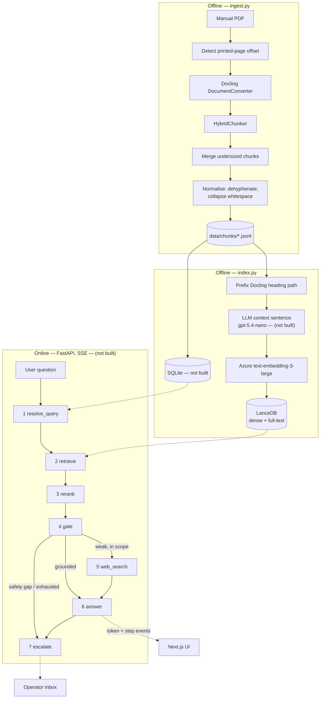

# Architecture

This document describes the intended boundaries and data flow. It must be kept in step with the code.
If a component named here does not exist yet, it is marked **(not built)**.

Everything runs locally. Azure OpenAI and Tavily are the only network calls.

Status: the offline half is built through chunking — parse, normalise, merge, page-offset detection.
Embedding and indexing are in progress. Nothing in the online half exists yet; every part of it is
marked **(not built)** below.

## Two halves

Ingestion is offline and runs once per manual. The application is online and never parses a PDF.



## Pipeline steps — (not built)

Each step is a class in `backend/app/pipeline/` with one `run(ctx)` method. `build_pipeline()`
assembles them in order. Adding a capability means adding a step. None of the seven exist yet; the
directory itself is not created.

**1 · resolve_query** — If the turn is a follow-up, rewrite it into a standalone question using the
last ~6 user turns, then concatenate the rewrite with the raw question. If there is no history, pass
through untouched. Also classifies whether the user is reporting that a previous suggestion failed,
which drives `unresolved_streak` (D14). This is what makes a reopened conversation continue correctly.

**2 · retrieve** — Hybrid search in LanceDB scoped to the session's manual: BM25 full-text and dense
vector in parallel, fused with Reciprocal Rank Fusion at k=60. Returns top-100 candidates carrying
page numbers and headings.

**3 · rerank** — Local cross-encoder (ONNX, CPU) scores the top-30 candidates and returns the best 6.
Roughly 300 ms — small against the answer call, and invisible to the user because the answer streams.

**4 · gate** — Reads reranker scores. The assistant does not dead-end: a weak manual result downgrades
the *source* of the answer, it does not refuse the question.

| Condition | Route | Answer source |
|---|---|---|
| top score above HIGH | answer from manual | `manual` |
| top score in partial band | answer from manual, supplement the gaps | `manual+general` |
| below LOW, safety-critical topic | escalate — never improvise here | — |
| below LOW, still about the product | web search + general expertise | `general` |
| below LOW, not about the product | decline | — |
| ambiguous band | one LLM grader call, then as above | — |

This is the Corrective-RAG pattern. The routing rules are pure functions over scores; the only model
call is the grader in the ambiguous band, and it returns a score, not a destination.

**5 · web_search** — Conditional. Runs only when the gate routes here. Tavily, scoped by the
`DOMAIN_DESCRIPTION` config value. Results carry no page citations.

**6 · answer** — One structured, streamed call returning:

```
format     direct | steps | troubleshoot | explanation
source     manual | manual+general | general
answer     the content, with safety warnings reproduced verbatim
citations  [{ page_pdf, page_printed, section }]   — empty when source is `general`
resolved   true | false
```

`source` drives the UI. Manual-grounded content shows page citations; general guidance is visibly
marked as not coming from the manual. The two must never render identically — an unmarked
general-knowledge answer about a real vehicle is the most damaging failure this system can produce.

**7 · escalate** — Deterministic. Triggers and streak mechanics in D14. Writes an `escalations` row
and surfaces a reference number to the user.

## Transport — (not built)

`POST /chat` returns Server-Sent Events. FastAPI `StreamingResponse`; no broker, no WebSocket server.

```
event: step    {"step": "retrieve", "label": "Searching the manual"}
event: step    {"step": "retrieve", "label": "Found 6 passages in Maintenance > Tyres"}
event: step    {"step": "web",      "label": "Not in the manual — checking the web"}
event: token   {"text": "..."}
event: done    {"source": "manual", "citations": [...], "resolved": true}
```

Step events describe work that actually happened. No invented stages, no artificial delays. A step
that is skipped emits no event.

## Boundaries

- Azure, LanceDB, Docling and Tavily SDK types stop in `backend/app/providers/`.
- Gate routing and escalation triggers are pure functions over scores and counters. The gate's
  ambiguous-band grader is the single exception, and it returns a relevance score, not a route.
- `routes.py` owns HTTP, `service.py` owns orchestration, `repository.py` owns SQLite.
- Settings are read only through `backend/app/config.py` and `frontend/src/lib/config.ts`.

## Data model — (not built)

No SQLite database exists yet. Ingestion writes JSONL only.

```
manuals      id, title, filename, page_count, page_offset, ingested_at

sessions     id, manual_id, title, unresolved_streak, created_at, updated_at

messages     id, session_id, role, content, source, format,
             citations_json, created_at

escalations  id, session_id, reference, issue_summary, steps_tried_json,
             pages_shown_json, trigger_reason, suggested_next,
             transcript_json, created_at
```

`manual_id` sits on the session, not the message — a conversation is locked to one manual (D11).

`page_offset` is detected per manual at ingest. In the BJ30 manual the printed page number is 5 lower
than the PDF index — the answer cites the printed number, the viewer navigates by the PDF index.
Getting this backwards shows the wrong page to the user.

## Screens — (not built)

| Screen | Purpose |
|---|---|
| Chat | Manual picker, conversation, streamed answer, citation pills, session history panel |
| PDF pane | Renders the cited page beside the answer; citations navigate it |
| Operator inbox | Lists open escalations; opens the full handoff package for one (D12) |

## Evaluation — (not built)

Slice 4. `eval/questions.jsonl` — one row per labelled question:

```json
{"question": "...", "manual": "...", "expected_pages": [137, 138], "expected_route": "manual"}
```

`expected_route` is one of `manual`, `partial`, `general`, `decline`, `escalate`.

`eval/run.py` reports Recall@10 and a routing-accuracy table. It exercises ingestion, retrieval,
reranking and the gate — not the answer prose.

## Deliberate omissions

Recorded so they are not mistaken for oversights. Reasons in `docs/decisions.md`.

- No agent framework. The flow is linear with two conditional branches.
- No semantic chunking, no Self-RAG, no reflection loops.
- No vision or multimodal retrieval — no GPU available.
- No WebSocket. Streaming is SSE, one-directional (D9).
- No external helpdesk integration. Escalations stay local (D12).
